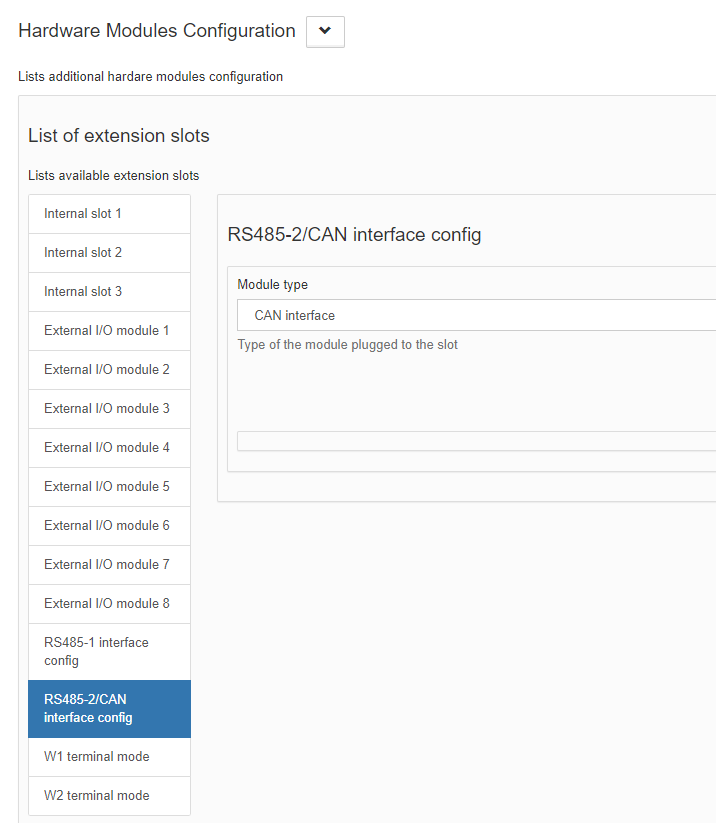
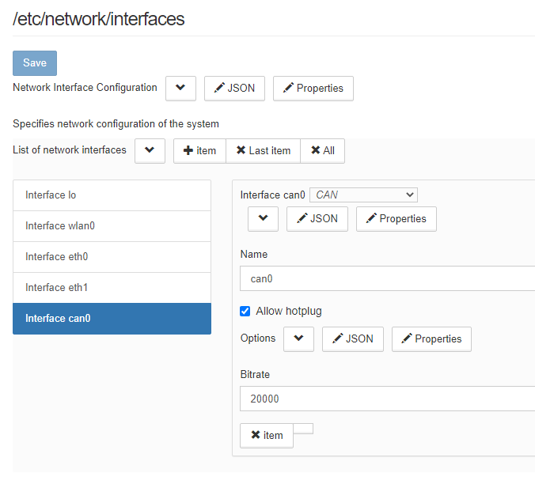

# wb-mqtt-smartweb
MQTT to SamrtWeb gateway which follows [Wiren Board MQTT Conventions](https://github.com/wirenboard/conventions/blob/main/README.md).
It's designed to be used on [Wiren Board](https://wirenboard.com/en) family of programmable automation controllers (PACs).

Шлюз предназначен для трансляции сообщений между MQTT брокером и системами с поддержкой протокола [SmartWeb](http://www.smartweb.su).
Шлюз предназначен для устройств [Wiren Board](https://wirenboard.com/ru) и соответствует [Конвенции Wiren Board MQTT](https://github.com/wirenboard/conventions/blob/main/README.md).

Запускается командой `systemctl start wb-mqtt-smartweb` или `service wb-mqtt-smartweb start`

Шлюз транслирует данные датчиков, доступных в MQTT на Wiren Board, в виде сенсоров виртуального контроллера SmartWeb X1 на CAN-шине. Также шлюз осуществляет опрос программ на шине SmartWeb и создаёт для них контролы в MQTT брокере.

Возможен запуск шлюза вручную, что может быть полезно для работы в отладочном режиме:
```
# service wb-mqtt-smartweb stop
# wb-mqtt-smartweb -d 3
```

<div style="page-break-after: always;"></div>

### Настройка CAN

Переключить порт RS-485/CAN в режим CAN на вкладке Hardware Modules Configuration.



Настроить в веб-интерфейсе (Settings - Configs - Hardware interfaces configuration) параметры CAN.



Либо вручную добавить в файл `/etc/network/interfaces` следующие строки:

```
allow-hotplug can0
iface can0 can static
bitrate 20000
```

### Структура конфигурационного файла

```javascript
{
  // Включает/выключает выдачу отладочной информации во время работы шлюза
  "debug" : false,

  // Интевал опроса параметров программ в сети SmartWeb, мс
  "poll_interval_ms": 1000,

  // Имя CAN интерфейса
  "interface_name": "can0",

  // Список виртуальных контроллеров в сети SmartWeb, от имени которых шлюз транслирует данные из MQTT
  "controllers": [
    {
      // Идентификатор виртуального контроллера
      "controller_id": 204,

      // Список датчиков виртуального контроллера SmartWeb
      "sensors": [
        {
          // Имя устройства и канала в терминах MQTT конвенции,
          // разделённые символом "/". В конкретном случае,
          // соответствующая MQTT-тема /devices/wb-adc/controls/Vin
          "channel": "wb-adc/Vin",

          // Время в минутах, по истечение которого, если не обновилось значение канала, 
          // соответствующим параметрам SmartWeb будет присвоен признак ошибки
          "value_timeout_min": 60,

          // Индекс соответствующего контролу датчика
          // Датчик также доступен как выход с индексом sensor_index - 1
          "sensor_index": 1
        },
        ...
      ],

      // Список параметров виртуального контроллера SmartWeb
      "parameters": [
        {
          // Имя устройства и канала в терминах MQTT конвенции,
          // разделённые символом "/". В конкретном случае,
          // соответствующая MQTT-тема /devices/wb-adc/controls/Vin
          "channel": "wb-adc/Vin",

          // Идентификатор параметра согласно протоколу SmartWeb
          "parameter_id": 1,

          // Тип программы, предоставляющей этот параметр
          "program_type": 11,

          // Индекс параметра
          "parameter_index": 0
        },
        ...
      ]
    },
    ...
  ]
}
```

<div style="page-break-after: always;"></div>

### Опрос программ SmartWeb

Шлюз автоматически определяет доступные программы в сети SmartWeb и создаёт для их датчиков, входов и параметров MQTT контролы. 

Типы программ должны быть описаны в отдельных json файлах. [Схема структуры файлов](wb-mqtt-smartweb-class.schema.json).

Встроенные файлы с описанием типов программ находятся в каталоге `/usr/share/wb-mqtt-smartweb/classes`.

Пользовательские файлы с описанием типов программ сохраняются в каталоге `/etc/wb-mqtt-smartweb.conf.d/classes`.

Пользовательские файлы имеют приоритет над встроенными. Это позволяет переопределять описания, поставляемые с пакетом.
Если описание пользователя переопределяет встроенное описание, то в лог сервиса будет записано сообщение об этом.